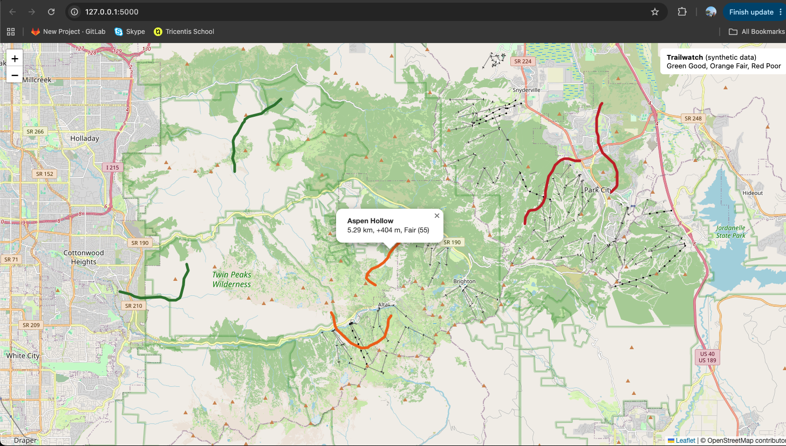

# Trailwatch




A small outdoor-conditions data pipeline with geospatial processing, a rule-based conditions score, a REST API and a map.

**All data is synthetic.** Trails, weather stations and daily readings are generated by `trailwatch/generate_data.py`. Nothing here is real conditions data, and the score is not a safety or avalanche tool.


## What it does

1. **Ingest and validate** (`pipeline.py`): loads trails, GPS points, stations and daily readings from CSV. Bad rows are rejected with a reason (missing value, out of range, duplicate, unknown station) and stored in a `rejected_readings` table.
2. **Geospatial processing** (`geo.py`): haversine distance, trail length, and elevation gain with a noise threshold for GPS elevation wiggle.
3. **Conditions score** (`scoring.py`): wind, temperature, precipitation and recent snow accumulation produce a 0-100 score and a Good, Fair or Poor rating with reasons.
4. **API and map** (`api.py`): Flask endpoints plus a Leaflet map that colors each trail by rating.

## Run it

```
python3 -m venv .venv && source .venv/bin/activate
pip install -r requirements.txt
python -m trailwatch.generate_data data
python -m trailwatch.pipeline data trailwatch.db
python -m trailwatch.api trailwatch.db
```

Open http://127.0.0.1:5000 for the map.

## API

| Endpoint | Returns |
| --- | --- |
| `GET /api/health` | status |
| `GET /api/trails` | all trails with length, elevation gain, score, rating, reasons |
| `GET /api/trails/<id>` | one trail |
| `GET /api/trails/<id>/geojson` | trail line as GeoJSON |

## Tests

```
python -m pytest -q
```

24 tests cover the geo math, validation rules, scoring rules and API responses. GitHub Actions runs them on every push and pull request.


